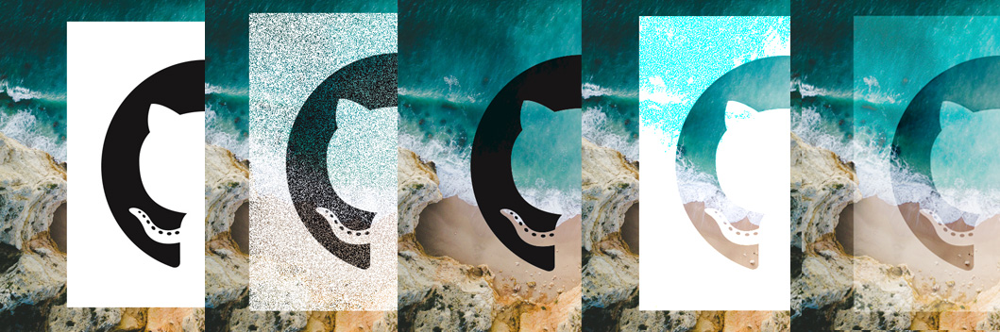

# The Grand Painter

Draw images on canvas with layer effects.



## Quick start

```typescript
import { paint, Processors } from 'the-grand-painter'

const stageElement = document.getElementById('stage') as HTMLCanvasElement
const imageElement = new Image()

// Put an image on a canvas.
paint({
  stage: stageElement,
  image: imageElement,
  x: 50, 
  y: 50,
  processor: Processors.Normal()
})

// "Overlay" a image on a canvas.
GrandPainter.feelTheUniverse({
  stage: stageElement,
  image: imageElement,
  x: 50, 
  y: 50,
  processor: Processors.Overlay()
})
```

## Processor List

 - ColorBurn
 - ColorDodge
 - Darken
 - Dissolve
 - Lighten
 - LighterColor
 - LinearBurn
 - LinearDodge
 - Multiply
 - Normal
 - Overlay
 - Screen
 - Softlight

## Example

Check examples in `dev/` for more information.
